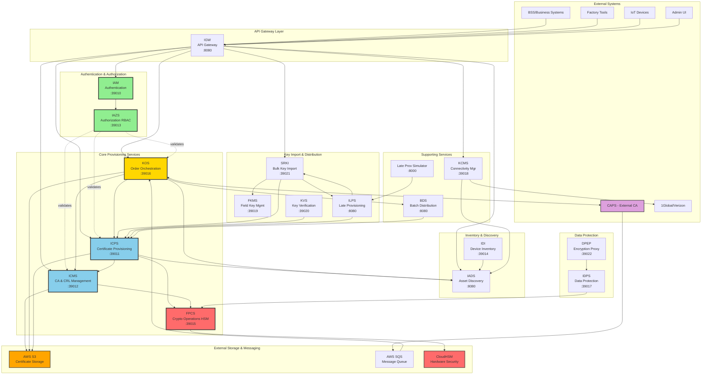
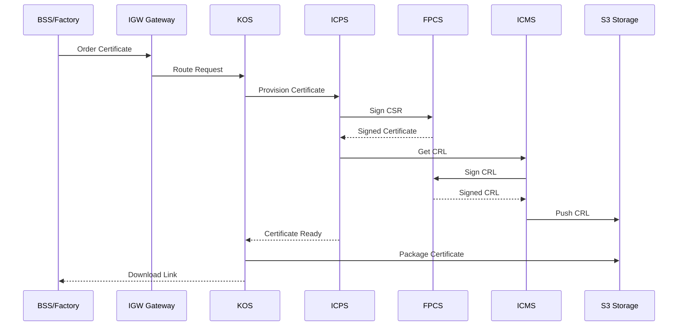
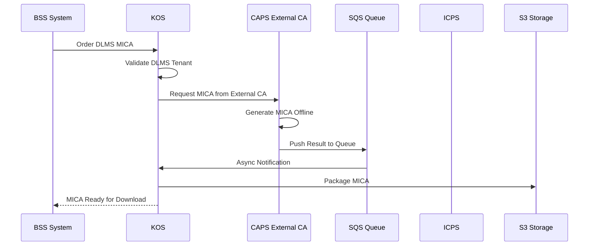
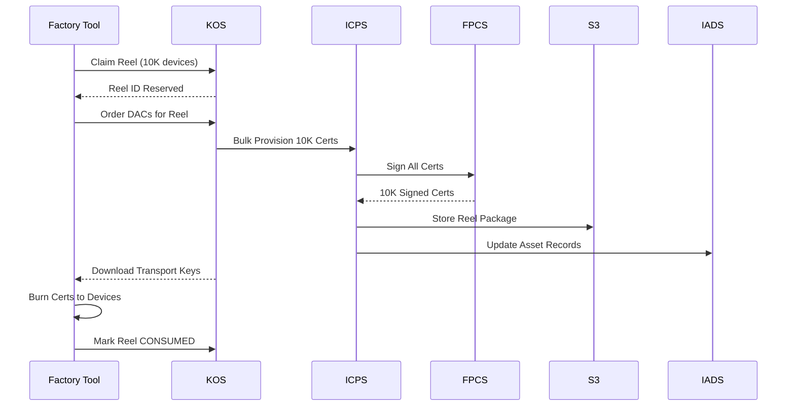
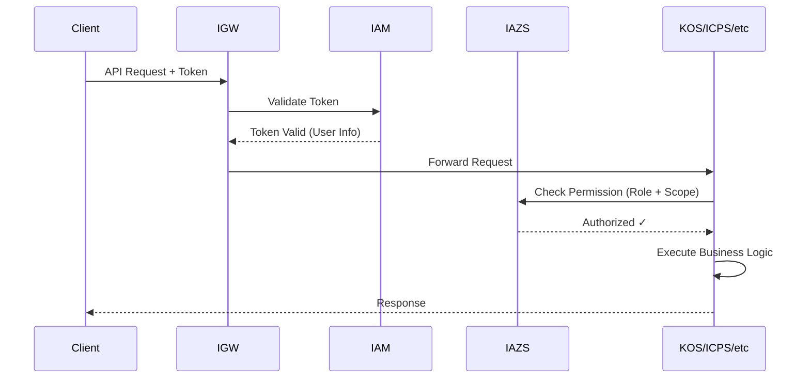
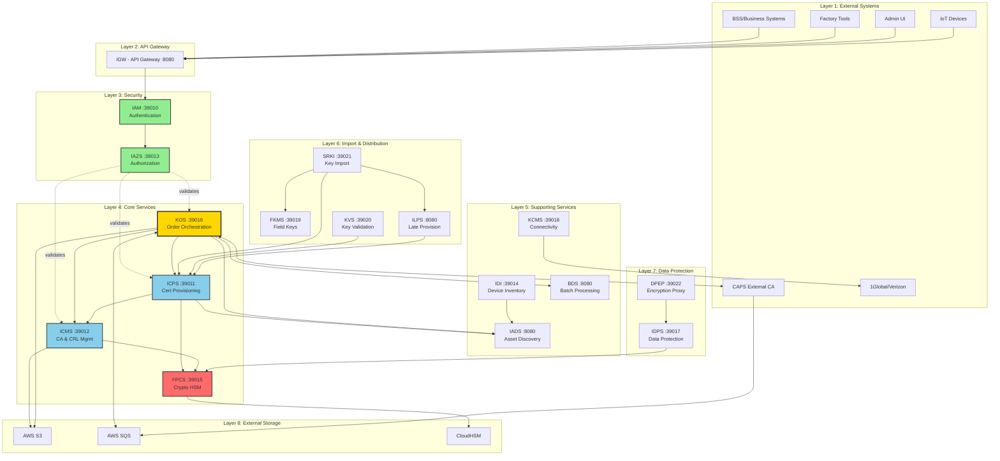

# COMPONENTS Architecture & Communication Map

**Generated:** May 18, 2026  
**Purpose:** Complete guide to all 19 microservices in the COMPONENTS ecosystem

---

## 📋 **Table of Contents**

1. [Visual Architecture Diagram](#visual-architecture-diagram)
2. [Quick Reference](#quick-reference)
3. [Detailed Component Descriptions](#detailed-component-descriptions)
4. [Communication Patterns](#communication-patterns)
5. [Integration Flows](#integration-flows)
6. [Technology Stack](#technology-stack)

---

## 🎨 **Visual Architecture Diagram**

### **Complete COMPONENTS Ecosystem Architecture**



### **Legend:**
- 🟨 **Gold** = KOS (Central Orchestrator)
- 🔵 **Blue** = Core Provisioning (ICPS, ICMS)
- 🔴 **Red** = Security Critical (FPCS, HSM)
- 🟢 **Green** = Authentication & Authorization
- 🟠 **Orange** = External Storage/Services
- 🟣 **Purple** = External CA Provider

### **Key Communication Patterns:**
- **Solid Lines** (→) = Direct REST API calls
- **Dotted Lines** (-.->)  = Authorization/Validation checks
- **Bi-directional** (↔) = Two-way communication

---

## 🔄 **Simplified Data Flow Diagrams**

### **Certificate Order Flow (High-Level)**



### **DLMS Order Flow (with External CA)**



### **Bulk Manufacturing Flow (Reels)**



### **Authentication & Authorization Flow**



---

## 🎯 **Quick Reference**

| Service    | Full Name                            | Primary Purpose                                     | Port  | Key Integrations                     |
| ---------- | ------------------------------------ | --------------------------------------------------- | ----- | ------------------------------------ |
| **KOS**    | Key Operating System                 | Certificate order orchestration & DLMS provisioning | 39016 | ICPS, ICMS, FPCS, CAPS               |
| **ICPS**   | IoT Certificate Provisioning Service | Certificate lifecycle management & issuance         | 39011 | FPCS, ICMS, KOS, SRKI                |
| **ICMS**   | IoT Certificate Management Service   | CA certificate & CRL management                     | 39012 | FPCS, ICPS, CAPS                     |
| **FPCS**   | Factory Provisioning Crypto Service  | HSM-backed cryptographic operations                 | 39015 | All services (crypto operations)     |
| **IAM**    | Identity & Access Management         | Authentication & authorization                      | 39010 | All services (auth token validation) |
| **IADS**   | IoT Asset Discovery Service          | Asset/device inventory & search                     | 8080  | KOS, ICPS, KCMS                      |
| **IAZS**   | ISEP Authorization Service           | Role-based access control (RBAC)                    | 39013 | IAM, All services                    |
| **IDI**    | IoT Device Inventory                 | Device registry & metadata                          | 39014 | IADS, KOS                            |
| **IDPS**   | IoT Data Protection Service          | Data encryption & key wrapping                      | 39017 | FPCS, DPEP                           |
| **IGW**    | IoT Gateway                          | API gateway & request routing                       | 8080  | All services (routing)               |
| **ILPS**   | IoT Late Provisioning Service        | Post-factory key injection                          | 8080  | SRKI, ICPS, KOS                      |
| **FKMS**   | Field Key Management Service         | Field key storage & retrieval                       | 39019 | SRKI, ICPS                           |
| **KCMS**   | KeySTREAM Connectivity Manager       | SIM OTA & connectivity provider mgmt                | 39018 | IADS (for RecovR)                    |
| **KVS**    | Key Verification Service             | Key validation & testing                            | 39020 | ICPS, SRKI                           |
| **SRKI**   | Secure Root Key Import               | Bulk key file import & distribution                 | 39021 | ICPS, FKMS, ILPS                     |
| **BDS**    | Batch Distribution Service           | Async batch job processing                          | 8080  | KOS, ICPS                            |
| **DPEP**   | Data Protection Encryption Proxy     | Encryption/signing proxy service                    | 39022 | IDPS, FPCS                           |
| **ICMS**   | IoT CMS (Content Management)         | -                                                   | -     | -                                    |
| **LPSimu** | Late Provisioning Simulator          | Testing tool for late provisioning                  | 8000  | ILPS, KOS                            |

---

## 📖 **Detailed Component Descriptions**

### **1. KOS - Key Operating System** 🔑

**What it does:**

- **Certificate Order Orchestration**: Central hub for ALL certificate ordering across the platform
- **Multi-Protocol Support**: DLMS (smart meters), Matter (IoT), LoRaWAN, General PKI
- **Bulk Manufacturing**: Reel management for high-volume production lines
- **Product Management**: Matter product definitions and vendor configurations
- **Order Lifecycle**: Tracks orders from creation → provisioning → delivery → consumption
- **Audit & Analytics**: Comprehensive reporting, statistics, and compliance logging

**Business Value:**

- Single API for all certificate ordering needs
- Supports both factory floor (reels) and on-demand (individual orders)
- Enforces business rules across multiple protocols
- Production-ready analytics and audit trails

**Key Features:**

**1. General Order Management** 📦

- Create orders for device certificates, CA certificates, keys
- Order status tracking (CREATED → PROVISIONING → DELIVERED)
- Order acknowledgement workflow
- Batch order statistics
- Order consumption tracking (how many certs used from an order)
- Multi-tenant isolation

**2. DLMS Orders** 🔋 (Smart Meter Provisioning)

- **MICA Orders**: Manufacturer Identification & Certification Authority root certificates
- **DAC Orders**: Device Authentication Certificates (encrypted delivery via email)
- **QD Signature Orders**: Qualification Declaration signatures for compliance
- Integration with CAPS (external CA provider)
- Tenant validation (DLMS-enabled tenants only)
- SQS async processing for high volume

**3. Matter Certificate Orders** 🏠 (Smart Home/IoT)

- **Matter PAI Orders**: Product Attestation Intermediate certificates
- **Matter DAC Orders**: Device Attestation Certificates (production + test modes)
- **Test DAC Bundles**: Downloadable zip files for development/testing
- **PGP Authentication**: Signed bundles for source verification
- Vendor ID management (pulled from device manager config)
- CSR-based or KOS-generated key pairs

**4. Reel Management** 🎞️ (Bulk Manufacturing)

- **Claim Reels**: Reserve reel IDs for manufacturing batches
- **Reel Status Tracking**: CLAIMED, IN_PROGRESS, CONSUMED, EXPIRED
- **Parent/Child Reels**: Hierarchical reel organization
- **Transport Keys**: Secure key wrapping for reel data
- **PAI to DAC Mapping**: Link PAI certificates to DAC reels
- **Vendor Statistics**: Track reel consumption by vendor
- Supports IFX (Infineon) manufacturing workflows

**5. Product Management** 🏭 (Matter Products)

- **Create Products**: Define Matter product types (VendorID + ProductID)
- **Product Information Retrieval**: Get product metadata
- **Matter Product Data**: Vendor-specific configurations
- Update and delete products
- Multi-product batch creation

**6. LoRaWAN Key Management** 📡

- **Retrieve LoRaWAN Keys**: Get keys by RoT Public UID + Keyset ID
- Supports LoRaWAN device provisioning
- Integration with ICPS for key storage

**7. Audit & Compliance** 📊

- **Audit Log Reports**: Device-level audit trails
- **Error Reports**: Failed provisioning investigation
- **Order Statistics**: DACs delivered per tenant
- **Quantities Over Time**: Historical order tracking
- Compliance reporting for regulatory requirements

**8. Backup & Restore** 💾

- **Tenant Data Deletion**: Complete tenant cleanup (GDPR compliance)
- Platform admin operations

**9. Recipient Management** 📧

- Manage certificate delivery recipients
- Email validation and tracking
- Encrypted package delivery

**APIs:**

**General Orders:**

- `POST /dm/{dm_uuid}/orders` - Create new order
- `GET /dm/{dm_uuid}/orders` - List all orders for tenant
- `GET /dm/{dm_uuid}/orders/{order_ref}` - Get specific order
- `GET /dm/{dm_uuid}/devices/{rot_public_uid}` - Find order by device ID
- `PUT /dm/{dm_uuid}/orders/{order_ref}/acknowledge` - Acknowledge order received
- `PUT /dm/{dm_uuid}/orders/{order_ref}/recipientstatus` - Update consumption status
- `GET /dm/{dm_uuid}/orders/statistics` - Get order stats
- `GET /dm/{dm_uuid}/orders/quantitiespertime` - Time-series order data

**DLMS Orders:**

- `POST /dm/{dm_uuid}/dlms/mica` - Create MICA order
- `POST /dm/{dm_uuid}/dlms/dacs` - Create DAC order (async)
- `POST /dm/{dm_uuid}/dlms/qd` - Create QD signature order
- `GET /dm/{dm_uuid}/dlms/mica?flagId={id}` - Get MICA by Flag ID
- `GET /pa/{dm_uuid}/dlms?orderId=&orderType=&status=` - List all DLMS orders

**Matter Orders:**

- `POST /pa/{dm_uuid}/matter/pai` - Create Matter PAI order
- `PUT /pa/orders/{order_ref}/matter/pai` - Update PAI certificate
- `GET /dm/{dm_uuid}/orders/{order_ref}/matter/dac` - Download test DAC bundle
- `GET /dm/matter/dac/keystreamauthenticationkey` - Get PGP public key

**Reel Management:**

- `POST /dm/{dm_uuid}/reels/{reel_id}` - Claim reel
- `GET /dm/{dm_uuid}/reels` - List all reels (with pagination)
- `GET /dm/{dm_uuid}/reels/{reel_id}` - Get specific reel info
- `DELETE /dm/{dm_uuid}/reels/{reel_id}` - Delete reel
- `PUT /dm/{dm_uuid}/reels/{reel_id}` - Update reel status
- `GET /pa/{dm_uuid}/reels/parent` - Get parent reels
- `POST /pa/{dm_uuid}/reels/vendor/statistics` - Vendor consumption stats
- `GET /dm/{dm_uuid}/reels/transportkeys` - Get transport keys for reel

**Product Management:**

- `POST /pa/{dm_uuid}/products` - Create product
- `GET /dm/{dm_uuid}/products` - List products
- `GET /dm/{dm_uuid}/products/{product_id}` - Get product details
- `PUT /pa/{dm_uuid}/products/{product_id}` - Update product
- `DELETE /pa/{dm_uuid}/products/{product_id}` - Delete product

**LoRaWAN:**

- `GET /dm/{dm_uuid}/rots/{rot_public_uid}/keysetids/{key_set_id}/lorawankeys` - Retrieve LoRaWAN keys

**Audit:**

- `GET /dm/{dm_uuid}/auditlogreports` - Get audit logs
- `GET /dm/{dm_uuid}/auditlogreports/orders/{order_uuid}` - Get order audit report
- `GET /dm/{dm_uuid}/auditlogerrors/orders/{order_uuid}` - Get order error report

**Admin:**

- `DELETE /pa/{dm_uuid}` - Delete tenant (backup/restore)
- `POST /internal/pa/processPendingDacs` - Process pending DAC orders (internal)

**Data Flows:**

**Standard Order Flow:**

```
BSS → KOS → ICPS (provision) → FPCS (sign) → S3 (store) → KOS → BSS (download)
```

**DLMS MICA Flow:**

```
BSS → KOS → Validate DLMS Tenant → CAPS (external CA) → SQS → KOS → Package → S3 → BSS
```

**Matter DAC Flow:**

```
Factory → KOS → ICPS (create PAI) → ICMS (store) → KOS (link to reel) → Factory (download reel)
```

**Reel Manufacturing Flow:**

```
Factory → Claim Reel → Order DACs → Provision Batch → Download Transport Keys → Burn to Devices → Mark CONSUMED
```

**Integration Points:**

- **→ ICPS**: Certificate provisioning (all order types)
- **→ FPCS**: Cryptographic signing operations
- **→ ICMS**: CA certificate storage and CRL management
- **→ CAPS**: External DLMS CA provider (SQS integration)
- **→ S3**: Certificate package storage and delivery
- **→ SQS**: Async order processing (high volume)
- **← BSS**: External ordering systems
- **← Factory Tools**: Manufacturing floor integrations
- **← Admin UI**: Manual order management

---

### **2. ICPS - IoT Certificate Provisioning Service** 📜

**What it does:**

- **Certificate Issuance**: Generates X.509 certificates for devices, manufacturers, intermediates
- **Lifecycle Management**: Handles cert creation, renewal, revocation
- **Batch Operations**: Bulk certificate provisioning
- **Certificate Storage**: Persists certificates and metadata

**Business Value:**

- Core provisioning engine for the entire platform
- Supports multiple certificate types (device, CA, Matter PAI)
- Handles high-volume manufacturing scenarios

**Key Features:**

- **Device Certificate Provisioning**: TLS/DTLS certs for IoT devices
- **Matter PAI Support**: Product Attestation Intermediate certificates
- **IMSI Management**: Associates certificates with SIM identities
- **Revocation Support**: Certificate blacklisting & CRL integration

**APIs:**

- `POST /certificates/device` - Provision device certificate
- `POST /certificates/batch` - Bulk provisioning
- `DELETE /certificates/{certId}` - Revoke certificate
- `POST /imsi/batch` - Import IMSI mappings
- `GET /certificates/{certId}` - Retrieve certificate

**Integration Points:**

- **→ FPCS**: For signing operations (CSR signing)
- **→ ICMS**: For CA cert retrieval & CRL validation
- **→ SRKI**: Receives bulk key imports
- **← KOS**: Receives provisioning requests

---

### **3. ICMS - IoT Certificate Management Service** 🏛️

**What it does:**

- **CA Certificate Management**: Stores & manages Certificate Authority certs
- **CRL Generation**: Creates and renews Certificate Revocation Lists
- **Online/Offline PAI Handling**:
  - **Online PAI**: ICMS signs CRL (has private key)
  - **Offline PAI**: CAPS signs CRL (ICMS provides path only)
- **S3 Integration**: Pushes CRLs to object storage

**Business Value:**

- Centralized trust anchor management
- Automates CRL lifecycle (generation, renewal, publication)
- Supports both internally managed and externally managed CAs

**Key Features:**

- **CA Upload**: Import CA certificates (Matter PAI, custom CAs)
- **CRL Automation**: Scheduled CRL renewal for online PAIs
- **CRL Path Generation**: Deterministic S3 path from certificate SKI
- **Private Key Management**: Optional HSM-backed private keys

**APIs:**

- `POST /{dm_uuid}/certificateauthorities` - Upload CA certificate
- `GET /{dm_uuid}/certificateauthorities/{ca_name}/crl` - Get CRL (path or content)
- `POST /{dm_uuid}/certificateauthorities/{common_name}/matter/pai` - Create PAI
- `POST /crl/renewal` - Trigger CRL renewal scheduler

**Integration Points:**

- **→ FPCS**: Sign CRLs for online PAIs
- **→ S3**: Push CRLs to object storage
- **← ICPS**: Provide CA certs for validation
- **← CAPS**: External service uploads CRLs for offline PAIs

**CRL Logic:**

```java
if (isMatterPai) {
    if (hasPrivateKey) {
        // Online PAI: ICMS signs & manages CRL
        signEmptyCrl(caCert);
        pushCrlToS3(caCert, crl);
        setCrlDuration(30 days);
    } else {
        // Offline PAI: CAPS manages CRL, ICMS provides path
        // No CRL metadata stored
    }
    // Both return CRL path: s3://bucket/matter/{SKI1}{SKI2}.crl
}
```

---

### **4. FPCS - Factory Provisioning Crypto Service** 🔐

**What it does:**

- **HSM Operations**: All cryptographic operations backed by Hardware Security Module
- **Signing Service**: Signs certificates, CRLs, data blobs
- **Key Generation**: Creates key pairs in HSM
- **Encryption/Decryption**: Protects sensitive data

**Business Value:**

- Security-critical operations isolated in hardened service
- FIPS 140-2 Level 3 compliance via HSM
- Single point of control for crypto operations

**Key Features:**

- **CSR Signing**: Sign Certificate Signing Requests
- **CRL Signing**: Sign Certificate Revocation Lists
- **Data Signing**: Generic signature operations
- **Key Wrapping**: Protect keys for transport
- **HSM Key Management**: Manages keys by name/ID in HSM

**APIs:**

- `POST /sign/csr` - Sign certificate request
- `POST /sign/crl` - Sign CRL
- `POST /sign/data` - Sign arbitrary data
- `POST /keys/generate` - Generate key pair in HSM
- `POST /encrypt` - Encrypt data with HSM key

**Integration Points:**

- **← ICMS**: CRL signing requests
- **← ICPS**: Certificate signing requests
- **← DPEP**: Data encryption/signing
- **← All Services**: Any crypto operations

---

### **5. IAM - Identity & Access Management** 👤

**What it does:**

- **User Authentication**: Login & token issuance
- **Token Validation**: OAuth2/JWT token verification
- **Session Management**: User session lifecycle
- **Credential Management**: Password policies, API keys

**Business Value:**

- Centralized authentication for all microservices
- Secure token-based API access
- Audit trail for user actions

**Key Features:**

- **OAuth2 Provider**: Token-based auth
- **Multi-Tenant Support**: Tenant isolation
- **Role Management**: User → role mapping (enforced by IAZS)
- **API Key Auth**: Service-to-service authentication

**APIs:**

- `POST /auth/login` - User authentication
- `POST /auth/token` - Token generation
- `POST /auth/validate` - Token validation (used by all services)
- `POST /auth/refresh` - Refresh token
- `GET /users/{userId}` - User details

**Integration Points:**

- **→ IAZS**: Role-based authorization decisions
- **← All Services**: Token validation on every API call

---

### **6. IADS - IoT Asset Discovery Service** 🔍

**What it does:**

- **Asset Registry**: Central inventory of all devices/assets
- **Search & Query**: Find devices by attributes (IMSI, serial, model)
- **Asset Metadata**: Stores device properties, tags, custom fields
- **Relationship Tracking**: Links devices to certificates, keys, tenants

**Business Value:**

- Single source of truth for device inventory
- Enables operational queries ("show all devices in tenant X")
- Supports device lifecycle tracking

**Key Features:**

- **Device Registration**: Create/update device records
- **Advanced Search**: Filter by tenant, model, status, custom attributes
- **Certificate Mapping**: Link devices to their certificates
- **Bulk Operations**: Import/export device lists

**APIs:**

- `POST /assets` - Register new asset
- `GET /assets?query={filter}` - Search assets
- `PUT /assets/{assetId}` - Update asset metadata
- `GET /assets/{assetId}/certificates` - Get device certificates

**Integration Points:**

- **← KOS**: Receives device provisioning events
- **← ICPS**: Updates with certificate issuance
- **← KCMS**: Connectivity status updates

---

### **7. IAZS - ISEP Authorization Service** 🛡️

**What it does:**

- **Role-Based Access Control (RBAC)**: Enforces permissions
- **Scope Validation**: Tenant/resource-level access control
- **Policy Engine**: Evaluates "can user X do action Y on resource Z?"
- **Custom Annotations**: `@RolesAllowed`, `@CheckScope`

**Business Value:**

- Fine-grained authorization across all services
- Tenant isolation enforcement
- Audit-ready access decisions

**Key Features:**

- **Role Definitions**: `PLATFORM_ADMIN`, `DM_ADMIN`, `DM_WATCHER`, etc.
- **Scope Checking**: Validates tenant UUID access
- **Policy Management**: Centralized permission rules
- **Delegation Support**: Service-to-service authorization

**APIs:**

- `POST /authorize` - Check permission for action
- `GET /roles/{userId}` - Get user roles
- `GET /permissions/{roleId}` - Get role permissions

**Integration Points:**

- **← All Services**: Every @RolesAllowed annotation calls IAZS
- **→ IAM**: User identity resolution

**Authorization Flow:**

```
User Request → IAM (token validation) → IAZS (role check) → Service (business logic)
```

---

### **8. IDI - IoT Device Inventory** 📋

**What it does:**

- **Device Registry**: Similar to IADS but focused on manufacturing data
- **Serial Number Management**: Allocates & tracks device serials
- **Production Metadata**: Manufacturing batch, factory, date
- **Device Families**: Groups devices by model/SKU

**Business Value:**

- Supports factory floor operations
- Tracks production history
- Links manufacturing to provisioning

**Key Features:**

- **Serial Generation**: Auto-increment or custom ranges
- **Batch Tracking**: Manufacturing batch → device mapping
- **Family Management**: Device model definitions

**APIs:**

- `POST /devices` - Register device
- `GET /devices/{serialNumber}` - Lookup device
- `POST /families` - Create device family

**Integration Points:**

- **→ IADS**: Syncs device data
- **← Factory Systems**: Receives production data

---

### **9. IDPS - IoT Data Protection Service** 🔒

**What it does:**

- **Key Wrapping**: Encrypts keys for safe storage/transport
- **Data Encryption**: Protects sensitive data payloads
- **Envelope Encryption**: Keys encrypted by master keys
- **Secure Key Delivery**: Wraps keys for device injection

**Business Value:**

- Protects sensitive provisioning data
- Enables secure key distribution to factories
- Compliance with data protection regulations

**Key Features:**

- **Wrap/Unwrap**: Encrypt/decrypt keys
- **Payload Encryption**: Protects data blobs
- **Master Key Management**: Tenant-specific master keys

**APIs:**

- `POST /wrap` - Wrap a key
- `POST /unwrap` - Unwrap a key
- `POST /encrypt` - Encrypt data
- `POST /decrypt` - Decrypt data

**Integration Points:**

- **→ FPCS**: Uses HSM for wrapping operations
- **← DPEP**: Higher-level encryption proxy

---

### **10. IGW - IoT Gateway** 🌐

**What it does:**

- **API Gateway**: Single entry point for external requests
- **Request Routing**: Routes to backend microservices
- **Load Balancing**: Distributes traffic
- **SSL Termination**: Handles HTTPS for external clients

**Business Value:**

- Simplified external integration (one URL)
- Cross-cutting concerns (rate limiting, logging)
- Backend service abstraction

**Key Features:**

- **Path-Based Routing**: `/kos/*` → KOS, `/icps/*` → ICPS
- **Request Transformation**: Header injection, URL rewriting
- **Circuit Breaker**: Fault tolerance

**Integration Points:**

- **→ All Services**: Routes external traffic
- **← External Systems**: BSS, factory tools, admin UI

---

### **11. ILPS - IoT Late Provisioning Service** ⏱️

**What it does:**

- **Post-Factory Provisioning**: Inject keys after device leaves factory
- **Delayed Key Injection**: Security-sensitive keys added later
- **Credential Updates**: Rotate keys in field
- **Test Mode**: Simulated provisioning for development

**Business Value:**

- Enables flexible provisioning workflows
- Reduces factory floor security risks
- Supports key rotation scenarios

**Key Features:**

- **Late Key Injection**: Add keys to already-manufactured devices
- **Batch Processing**: Bulk late provisioning
- **Simulation Support**: Test provisioning without real devices

**APIs:**

- `POST /provision/late` - Late provision device
- `POST /batch` - Bulk late provisioning
- `GET /status/{requestId}` - Check provisioning status

**Integration Points:**

- **→ SRKI**: Receives key files
- **→ ICPS**: Triggers certificate issuance
- **← Factory Tools**: Provisioning requests

---

### **12. FKMS - Field Key Management Service** 🗝️

**What it does:**

- **Key Storage**: Persists keys for field devices
- **Key Retrieval**: Serves keys to authorized devices
- **Key Lifecycle**: Tracks key expiration & rotation
- **Secure Distribution**: Encrypted key delivery

**Business Value:**

- Field devices can retrieve keys on demand
- Supports key rotation without device re-provisioning
- Enables zero-touch onboarding

**Key Features:**

- **Key Registry**: Stores keys indexed by device ID
- **Expiration Management**: Automatic key rotation triggers
- **Access Control**: Only authorized devices can retrieve

**APIs:**

- `POST /keys` - Store key for device
- `GET /keys/{deviceId}` - Retrieve key
- `DELETE /keys/{keyId}` - Revoke key

**Integration Points:**

- **← SRKI**: Receives imported keys
- **→ Devices**: Direct key retrieval (via IGW)

---

### **13. KCMS - KeySTREAM Connectivity Manager** 📡

**What it does:**

- **SIM OTA Management**: Over-the-air SIM provisioning
- **Connectivity Provider Mgmt**: Switch between 1Global, Verizon, etc.
- **Subscription Lifecycle**: Activate/deactivate SIMs
- **Provider Integration**: APIs to connectivity providers

**Business Value:**

- Manages device connectivity (not just crypto)
- Supports RecovR solution (remote recovery devices)
- Multi-provider flexibility

**Key Features:**

- **SIM Provisioning**: OTA profile installation
- **Provider Switching**: Migrate devices between networks
- **Usage Monitoring**: Data consumption tracking

**APIs:**

- `POST /sim/provision` - Provision SIM
- `POST /sim/switch` - Switch provider
- `GET /sim/{iccid}/status` - Check connectivity

**Integration Points:**

- **→ 1Global, Verizon**: External provider APIs
- **→ IADS**: Device → SIM mapping

---

### **14. KVS - Key Verification Service** ✅

**What it does:**

- **Key Validation**: Verifies key correctness
- **Test Provisioning**: Dry-run provisioning without persistence
- **Key Quality Checks**: Entropy testing, format validation
- **Compliance Testing**: Ensures keys meet security policies

**Business Value:**

- Catches bad keys before production use
- Validates imported key files
- Compliance audit support

**Key Features:**

- **Format Validation**: Checks key structure
- **Strength Testing**: Ensures cryptographic quality
- **Mock Provisioning**: Tests without side effects

**APIs:**

- `POST /verify/key` - Validate key
- `POST /test/provision` - Dry-run provisioning

**Integration Points:**

- **← SRKI**: Validates bulk imports
- **← ICPS**: Pre-provisioning validation

---

### **15. SRKI - Secure Root Key Import** 📥

**What it does:**

- **Bulk Key Import**: Upload key files (CSV, XML, JSON)
- **Key Distribution**: Routes keys to appropriate services
- **Format Parsing**: Supports multiple key file formats
- **Async Processing**: SQS-based batch jobs

**Business Value:**

- Factory integration for pre-generated keys
- Handles millions of keys efficiently
- Supports various vendor key formats

**Key Features:**

- **Multi-Format Support**: ISEP, G+D, generic CSV
- **Batch Processing**: Asynchronous import jobs
- **Duplicate Detection**: Prevents key collisions
- **IMSI Import**: Bulk SIM identity loading

**APIs:**

- `POST /import/keys` - Upload key file
- `POST /import/imsi` - Upload IMSI file
- `GET /import/status/{jobId}` - Check import status
- `GET /keys/info` - Get key file metadata

**Integration Points:**

- **→ ICPS**: Sends provisioned keys
- **→ FKMS**: Stores field keys
- **→ ILPS**: Late provisioning keys
- **← Factory Tools**: Receives key files

---

### **16. BDS - Batch Distribution Service** 🔄

**What it does:**

- **Async Job Processing**: Long-running tasks
- **Batch Order Fulfillment**: Process bulk certificate orders
- **Scheduled Jobs**: Cron-like task execution
- **Job Status Tracking**: Monitor batch progress

**Business Value:**

- Handles high-volume operations without blocking
- Scales independently from sync services
- Retry logic for failed batches

**Key Features:**

- **Job Scheduling**: Queue batch jobs
- **Progress Monitoring**: Real-time status updates
- **Error Handling**: Retry failed items
- **Result Aggregation**: Batch results collection

**APIs:**

- `POST /jobs/batch` - Submit batch job
- `GET /jobs/{jobId}` - Get job status
- `DELETE /jobs/{jobId}` - Cancel job

**Integration Points:**

- **← KOS**: Large order batches
- **→ ICPS**: Bulk provisioning requests

---

### **17. DPEP - Data Protection Encryption Proxy** 🔐

**What it does:**

- **Encryption Proxy**: Higher-level wrapper over IDPS/FPCS
- **Data Signing**: Sign data payloads
- **Simplified Crypto API**: Easier interface for common operations
- **Policy Enforcement**: Encryption standards enforcement

**Business Value:**

- Simplifies crypto operations for clients
- Enforces encryption best practices
- Abstraction layer over underlying crypto services

**Key Features:**

- **Encrypt/Sign**: Combined operation
- **Verify Signatures**: Data integrity checks
- **Key Selection**: Auto-selects appropriate keys

**APIs:**

- `POST /protect` - Encrypt and sign data
- `POST /verify` - Verify signature

**Integration Points:**

- **→ FPCS**: Crypto operations
- **→ IDPS**: Key wrapping
- **← Application Services**: Simplified crypto API

---

### **18. Late Provisioning Simulator** 🧪

**What it does:**

- **Testing Tool**: Simulates late provisioning scenarios
- **UI for Testing**: Web interface for manual testing
- **Automated Tests**: Integration test support
- **Mock Device Behavior**: Simulates device responses

**Business Value:**

- Enables testing without physical devices
- Supports development workflows
- Validates provisioning before production

**Key Features:**

- **Web UI**: Flask-based test interface
- **Device Simulation**: Mimics real device behavior
- **Batch Testing**: Test bulk operations
- **Result Visualization**: Shows provisioning outcomes

**Integration Points:**

- **→ ILPS**: Sends test provisioning requests
- **→ KOS**: Tests order flows

---

## 🔗 **Communication Patterns**

### **Synchronous Communication (REST/HTTP)**

Most services communicate via RESTful APIs:

```
Service A → HTTP POST → Service B → JSON Response → Service A
```

**Example: Certificate Order Flow**

```
BSS → KOS → ICPS → FPCS (sign CSR) → ICPS → ICMS (get CRL) → ICMS → KOS → BSS
```

### **Asynchronous Communication (SQS Queues)**

For long-running operations:

```
Service A → SQS Queue → Service B (worker) → Callback → Service A
```

**Example: Bulk Key Import**

```
SRKI → SQS → ICPS Workers → Batch Results → SRKI
```

### **Event-Driven Updates**

Asset status changes:

```
ICPS (cert issued) → Event → IADS (update asset) → Event → KOS (notify)
```

### **Authorization Pattern (All Services)**

Every secured API call:

```
Client → IAM (token) → Service (validate token) → IAZS (check role) → Business Logic
```

---

## 🌊 **Integration Flows**

### **Flow 1: General Certificate Order (Standard)**

```
┌─────────┐     ┌─────┐     ┌──────┐     ┌──────┐     ┌──────┐     ┌────┐
│ Client  │────→│ KOS │────→│ ICPS │────→│ FPCS │────→│ ICMS │────→│ S3 │
│BSS/UI   │     └─────┘     └──────┘     └──────┘     └──────┘     └────┘
└─────────┘        ↑            │            │            │            │
                   └────────────┴────────────┴────────────┴────────────┘
                                    Package returned
```

**Steps:**

1. Client (BSS/UI/Factory) sends order request to KOS
2. KOS validates tenant permissions and business rules
3. KOS sends provisioning request to ICPS
4. ICPS generates CSR, sends to FPCS for signing
5. FPCS signs with appropriate CA key (HSM-backed)
6. ICPS stores certificate
7. ICMS generates/updates CRL for the CA
8. ICMS pushes CRL to S3
9. KOS packages certificate + metadata
10. Client receives package download link or direct delivery

**Variants:**

- **DLMS Orders**: Includes CAPS integration via SQS for external CA
- **Matter Orders**: Includes Matter-specific metadata (Vendor ID, Product ID)
- **Reel Orders**: Bulk provisioning with transport key wrapping

---

### **Flow 2: DLMS MICA Order (with CAPS)**

```
┌─────┐     ┌─────┐     ┌──────┐     ┌──────┐     ┌────┐
│ BSS │────→│ KOS │────→│ CAPS │────→│ SQS  │────→│ S3 │
└─────┘     └─────┘     └──────┘     └──────┘     └────┘
   ↑           │           (ext)
   └───────────┴────────────────────────────────────────┘
                    Async callback via SQS
```

**Steps:**

1. BSS sends DLMS MICA order to KOS
2. KOS validates tenant has DLMS enabled
3. KOS sends request to CAPS (external CA provider)
4. CAPS generates MICA certificate offline
5. CAPS pushes result to SQS queue
6. KOS processes SQS message
7. KOS packages MICA + metadata
8. BSS polls for completion, downloads package

### **Flow 3: Matter Reel Manufacturing (Bulk Production)**

```
Factory Tool → KOS (claim reel) → KOS (order DACs) → ICPS (provision batch)
      ↓                                                       ↓
   Reel ID                                              FPCS (sign)
      ↓                                                       ↓
   KOS (get transport keys) ← IDPS ← S3 ← Package ← ICMS (CRL)
      ↓
   Device Programming Station → Mark CONSUMED → KOS (statistics)
```

**Steps:**

1. Factory claims reel ID (e.g., "REEL-001" for 10,000 devices)
2. Factory orders DACs for reel (linked to Matter PAI)
3. KOS triggers ICPS batch provisioning
4. ICPS generates 10,000 device certificates
5. FPCS signs all certificates with PAI private key
6. ICMS generates CRL for PAI
7. KOS packages certificates + CRL into reel bundle
8. Factory downloads transport keys (encrypted)
9. Factory programs devices on manufacturing line
10. Factory marks reel CONSUMED
11. KOS records statistics (vendor, product, quantity)

---

### **Flow 4: LoRaWAN Device Provisioning**

```
Device → KOS (request keys) → ICPS (lookup RoT) → KOS (return keys)
```

**Steps:**

1. LoRaWAN device provides RoT Public UID + Keyset ID
2. KOS queries ICPS for device keys
3. ICPS returns LoRaWAN-specific keys (AppKey, NwkKey)
4. KOS delivers keys to device

---

### **Flow 5: Bulk Device Provisioning (SRKI)**

```
Factory Tool → SRKI → SQS → ICPS Workers → IADS → KOS (notify)
                 ↓
               FKMS (store keys)
```

**Steps:**

1. Factory uploads key file to SRKI
2. SRKI parses file, submits batch job to SQS
3. ICPS workers process keys in parallel
4. Each key → device certificate provisioned
5. IADS updated with device records
6. FKMS stores field keys for later retrieval
7. KOS receives completion notification

### **Flow 6: Online PAI CRL Renewal**

```
ICMS Scheduler → ICMS → FPCS (sign CRL) → S3
                   ↓
              Database (update expiration)
```

**Steps:**

1. Scheduled job detects CRL expiration approaching
2. ICMS fetches CA certificate
3. ICMS queries ICPS for revoked certificates
4. ICMS builds CRL structure
5. FPCS signs CRL with CA private key
6. ICMS pushes signed CRL to S3
7. ICMS updates next expiration date (30 days)

---

### **Flow 7: Offline PAI CRL (CAPS-managed)**

```
CAPS (external) → S3 (push CRL)
                    ↑
                 ICMS (compute path, return to client)
```

**Steps:**

1. CAPS generates CRL offline (has private key)
2. CAPS pushes CRL to agreed S3 path
3. Client asks ICMS for CRL
4. ICMS computes path from certificate SKI
5. ICMS returns: `http://bucket/matter/{SKI1}{SKI2}.crl`
6. Client fetches CRL directly from S3

---

### **Flow 8: Late Provisioning**

```
Device → ILPS → SRKI (key lookup) → ICPS (provision) → Device (key injected)
```

**Steps:**

1. Device requests late provisioning
2. ILPS authenticates device
3. ILPS fetches key from SRKI
4. ILPS triggers ICPS provisioning
5. ICPS issues certificate
6. ILPS wraps key + cert for device
7. Device receives secure package

---

## 🛠️ **Technology Stack**

### **Backend Framework**

- **Dropwizard** (JAX-RS, Jersey)
- **Java 17**
- **Maven** (multi-module builds)

### **API Layer**

- **JAX-RS** annotations
- **OpenAPI 3.0** (Swagger)
- **Custom annotations**: `@RolesAllowed`, `@CheckScope`, `@CorrelationIdRequired`

### **Security**

- **OAuth2** tokens (IAM)
- **RBAC** (IAZS)
- **HSM** integration (FPCS via PKCS#11)
- **TLS** mutual auth for service-to-service

### **Data Layer**

- **Custom DAO pattern** (not Spring Data JPA)
- **PostgreSQL** (most services)
- **H2** (testing)
- **Liquibase** (migrations)

### **Async Processing**

- **AWS SQS** (queues)
- **Scheduled jobs** (Quartz)
- **Thread pools** (ExecutorService)

### **External Integrations**

- **AWS S3** (CRL storage, certificate packages)
- **CAPS** (external CA provider)
- **1Global, Verizon** (connectivity providers)
- **HSM** (CloudHSM, Thales)

### **Monitoring**

- **Correlation IDs** (request tracing)
- **Health checks** (`/healthcheck`)
- **Metrics** (Dropwizard Metrics)
- **SonarQube** (code quality)

### **Deployment**

- **Docker** containers
- **Jenkins** CI/CD
- **Kubernetes** (implied by compose.yml, Helm charts)
- **GitLab** (source control)

---

## 📊 **Service Dependencies Map**

### **Layered Architecture View**



### **ASCII Diagram (Legacy)**

```
┌─────────────────────────────────────────────────────────────────┐
│                         EXTERNAL SYSTEMS                         │
│   BSS, Factory Tools, Admin UI, Devices, CAPS, 1Global, Verizon │
└────────────────────┬────────────────────────────────────────────┘
                     │
                     ↓
              ┌──────────┐
              │   IGW    │  (API Gateway)
              └─────┬────┘
                    │
      ┌─────────────┼─────────────┬──────────────────┬─────────────┐
      │             │             │                  │             │
   ┌──▼──┐      ┌──▼──┐      ┌──▼──┐          ┌────▼────┐    ┌──▼──┐
   │ IAM │      │ KOS │      │ICPS │          │  IAZS   │    │IADS │
   └──┬──┘      └──┬──┘      └──┬──┘          └────┬────┘    └──┬──┘
      │            │             │                  │            │
      └────────────┼─────────────┼──────────────────┘            │
                   │             │                               │
              ┌────▼─────────────▼────┐                          │
              │        FPCS           │ ◄────────────────────────┘
              └────┬─────────────┬────┘
                   │             │
              ┌────▼────┐   ┌───▼────┐
              │  ICMS   │   │  DPEP  │
              └────┬────┘   └───┬────┘
                   │            │
              ┌────▼────┐   ┌───▼────┐
              │   S3    │   │  IDPS  │
              └─────────┘   └────────┘

      ┌──────────────────────────────────────────────┐
      │          DATA IMPORT SERVICES                │
      │  ┌──────┐   ┌──────┐   ┌──────┐   ┌──────┐  │
      │  │ SRKI │──→│ FKMS │   │ ILPS │──→│ KVS  │  │
      │  └──────┘   └──────┘   └──────┘   └──────┘  │
      └──────────────────────────────────────────────┘

      ┌──────────────────────────────────────────────┐
      │        SUPPORTING SERVICES                   │
      │  ┌──────┐   ┌──────┐   ┌──────┐   ┌──────┐  │
      │  │ BDS  │   │ IDI  │   │ KCMS │   │LPSimu│  │
      │  └──────┘   └──────┘   └──────┘   └──────┘  │
      └──────────────────────────────────────────────┘
```

### **Dependency Key:**

- **→**: Synchronous API call (REST)
- **──→**: Async message/event (SQS)
- **◄──**: Data retrieval
- **-.->**: Authorization/Validation check

---

## 🎨 **Interactive Chatbot Features**

### **Feature 1: Greeting Flow**

**User says:** "Hi"

**Bot responds:**

```
👋 Hi! I'm your COMPONENTS assistant. Hope you're doing great!

I can help you explore:
🔧 Components - Learn about each microservice
📚 Features - Explore specific capabilities (DLMS, provisioning, etc.)

What would you like to know about?
[Button: Components] [Button: Features]
```

---

### **Feature 2: Components Explorer**

**User clicks:** [Components]

**Bot responds:**

```
📦 **COMPONENTS Microservices**

Select a component to learn more:

🔑 Core Services
  • KOS - Certificate order orchestration
  • ICPS - Certificate provisioning
  • ICMS - CA & CRL management
  • FPCS - Cryptographic operations

🔐 Security & Access
  • IAM - Authentication
  • IAZS - Authorization (RBAC)
  • IDPS - Data protection
  • DPEP - Encryption proxy

📋 Inventory & Discovery
  • IADS - Asset discovery
  • IDI - Device inventory

📥 Import & Distribution
  • SRKI - Bulk key import
  • FKMS - Field key management
  • ILPS - Late provisioning
  • BDS - Batch processing

🌐 Connectivity & Gateway
  • IGW - API gateway
  • KCMS - Connectivity manager
  • KVS - Key verification

[Dropdown: Select Component]
```

**User selects:** KOS

**Bot responds:**

```
# 🔑 KOS - Key Operating System

**Port:** 39016
**Primary Purpose:** Certificate order orchestration & DLMS provisioning

## What KOS Does:
KOS is the central hub for requesting and managing certificates for IoT devices and manufacturers. It orchestrates complex workflows involving multiple backend services (ICPS, ICMS, FPCS, CAPS) to fulfill certificate orders.

## Key Features:
✅ **MICA Orders** - Manufacturer root certificate identity
✅ **DAC Orders** - Device Attestation Certificates (encrypted delivery)
✅ **QD Signatures** - Qualified Declaration signatures
✅ **DLMS Provisioning** - Smart meter certificate management

## APIs:
• `POST /orders/dlms/mica` - Create MICA order
• `POST /orders/dlms/dac` - Create DAC order
• `POST /orders/dlms/qd` - Create QD signature order
• `GET /orders/{orderId}` - Get order status

## Integrations:
→ **ICPS**: Certificate provisioning
→ **ICMS**: CRL management
→ **FPCS**: Cryptographic signing
→ **CAPS**: External CA provider
← **BSS**: Receives order requests

## Sample Order Flow:
1. BSS sends MICA order to KOS
2. KOS validates tenant permissions
3. KOS requests certificate from ICPS
4. ICPS signs via FPCS
5. ICMS generates CRL
6. KOS packages certificate + CRL
7. BSS downloads package

**Want to dive deeper?**
[Ask about DLMS] [Ask about MICA vs DAC] [See code examples]
```

---

### **Feature 3: Features Explorer**

**User clicks:** [Features]

**Bot responds:**

```
📚 **COMPONENTS Features**

Which component's features do you want to explore?

[Dropdown: Select Component]
  • KOS
  • ICPS
  • ICMS
  • FPCS
  • IAM
  • IAZS
  • ... (all 19 components)
```

**User selects:** KOS

**Bot shows:**

```
📚 **KOS Features**

Select a feature to learn more:

🔑 **Certificate Ordering**
  • DLMS Orders (MICA, DAC, QD)
  • Standard Certificate Orders
  • Bulk Order Processing

📦 **Package Management**
  • Certificate Package Creation
  • Encrypted Delivery (DAC)
  • S3 Storage Integration

✅ **Validation & Rules**
  • Tenant Validation
  • DLMS Enablement Checks
  • Order Status Tracking

[Select Feature...]
```

**User selects:** DLMS Orders

**Bot responds:**

```
# 🔑 DLMS Orders (KOS Feature)

**Documentation:** dlms-orders.md

## What is DLMS?
DLMS (Device Language Message Specification) is a protocol for smart metering. KOS manages DLMS certificate provisioning for three types of orders:

### 1. **MICA (Meter Identification and Certification Authority)**
- **Purpose:** Root certificate representing meter manufacturer identity
- **Who uses it:** Manufacturer root CA
- **Lifespan:** 10+ years (long-lived root)
- **API:** `POST /orders/dlms/mica`

**Business Flow:**
1. Manufacturer requests MICA certificate
2. KOS validates tenant is DLMS-enabled
3. ICPS provisions manufacturer CA cert
4. FPCS signs with appropriate root key
5. ICMS generates CRL for MICA
6. Package delivered to manufacturer

### 2. **DAC (Device Attestation Certificate)**
- **Purpose:** Intermediate certificate for device attestation
- **Who uses it:** Device manufacturers to sign device certs
- **Delivery:** Encrypted package sent to recipient email
- **API:** `POST /orders/dlms/dac`

**Business Flow:**
1. Manufacturer requests DAC (provides recipient email)
2. KOS validates email format (RFC 5322)
3. ICPS provisions DAC certificate
4. Package encrypted and sent to recipient
5. Recipient downloads encrypted package

### 3. **QD Signature (Qualified Declaration)**
- **Purpose:** Signature for device compliance declaration
- **Who uses it:** Regulatory compliance
- **Format:** CMS-signed declaration
- **API:** `POST /orders/dlms/qd`

## Status Lifecycle:
```

CREATED → PROVISIONING → COMPLETED → DELIVERED
↓
FAILED (error scenarios)

```

## Integration Points:
• **ICPS** - Certificate issuance
• **CAPS** - External CA signing
• **SQS** - Async order processing
• **S3** - Package storage
• **BSS** - Order requests

## Error Handling:
❌ **BadRequestException** - Invalid tenant or email
❌ **ConflictException** - Duplicate order
❌ **NotFoundException** - Order not found

## Code Locations:
• Service: `DlmsOrderService.java`
• Resource: `DlmsOrderResource.java`
• Entities: `DlmsMicaOrder.java`, `DlmsDacOrder.java`, `DlmsQdOrder.java`

**Want to see:**
[Code examples] [API documentation] [Test scenarios]
```

---

## 💡 **Implementation Plan for Chatbot**

### **Phase 1: Data Preparation**

1. ✅ Create this `COMPONENT_ARCHITECTURE.md` file
2. **TODO:** Ingest into ChromaDB
3. **TODO:** Tag chunks with metadata:
   - `type: "component_overview" | "feature" | "api" | "flow"`
   - `component: "kos" | "icps" | ...`
   - `feature: "dlms" | "provisioning" | ...`

### **Phase 2: Backend (FastAPI)**

1. **Update `generator.py`:**

   ```python
   def generate_interactive_greeting(user_input: str):
       if user_input.lower() in ["hi", "hello", "hey"]:
           return {
               "message": "👋 Hi! I'm your COMPONENTS assistant...",
               "buttons": [
                   {"label": "Components", "action": "show_components"},
                   {"label": "Features", "action": "show_features"}
               ]
           }
   ```

2. **Add button handlers:**

   ```python
   def handle_button_click(action: str):
       if action == "show_components":
           return show_component_list()
       elif action == "show_features":
           return show_feature_selector()
   ```

3. **Component selector:**
   ```python
   def show_component_list():
       components = [
           {"name": "KOS", "icon": "🔑", "category": "Core Services"},
           {"name": "ICPS", "icon": "📜", "category": "Core Services"},
           ...
       ]
       return {"type": "component_grid", "data": components}
   ```

### **Phase 3: Frontend (Streamlit)**

1. **Update chatbot UI:**

   ```python
   if response.get("buttons"):
       cols = st.columns(len(response["buttons"]))
       for idx, btn in enumerate(response["buttons"]):
           if cols[idx].button(btn["label"]):
               handle_action(btn["action"])
   ```

2. **Component grid display:**
   ```python
   if response["type"] == "component_grid":
       for category, components in group_by_category(response["data"]):
           st.subheader(category)
           cols = st.columns(4)
           for idx, comp in enumerate(components):
               with cols[idx % 4]:
                   if st.button(f"{comp['icon']} {comp['name']}"):
                       show_component_details(comp['name'])
   ```

### **Phase 4: Enhanced Retrieval**

1. **Boost component docs for component queries:**

   ```python
   if query_type == "component_info":
       boost_filter = {"type": "component_overview"}
   elif query_type == "feature_info":
       boost_filter = {"type": "feature"}
   ```

2. **Hierarchical navigation:**
   - Components → Component Details → Features → Feature Details → Code Examples

---

## ✅ **Next Steps**

1. **Review this document** - Validate descriptions are accurate
2. **Ingest into knowledge base** - Add to ChromaDB for RAG
3. **Update chatbot logic** - Implement greeting + button flows
4. **Test navigation** - Verify hierarchical exploration works
5. **Add remaining features** - Document features for each component

---

**Questions? Ask me:**

- "How does KOS communicate with ICPS?"
- "Show me the DLMS order flow"
- "What does FPCS do?"
- "Explain the difference between IADS and IDI"
